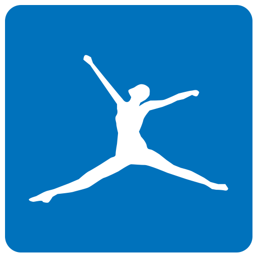
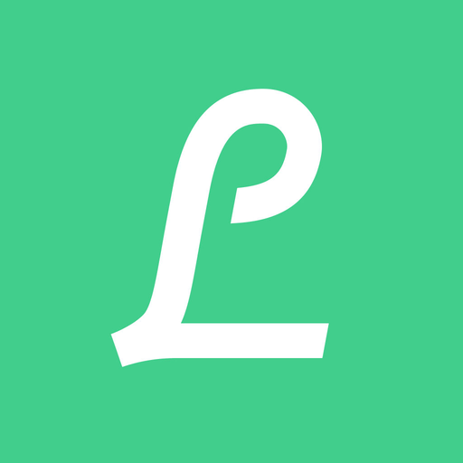

# Requirements Document
 ### Table of Contents
 1. [Introduction](#1)  
	1.1. [Purpose](#1.1)   
	1.2. [Business requirements](#1.2)  
		1.2.1. [Initial data](#1.2.1)  
		1.2.2. [Business opportunities](#1.2.2)  
	1.3. [Analogs](#analogs)  
2. [User Requirements](#2)  
	2.1. [Software Interfaces](#2.1)  
  	2.2. [User Interfaces](#2.2)  
  	2.3. [User Characteristics](#2.3)  
  		2.3.1. [User Classes](#2.3.1)  
  		2.3.2. [Target Audience](#2.3.2) 
  	2.4. [Assumptions and Dependencies](#2.4)  
3. [System Requirements](#3.)  
  	3.1. [Functional Requirements](#3.1)  
  		3.1.1. [Basic functionality](#3.1.1)  
  			3.1.1.1. [User logon to the application](#3.1.1.1) 
  			3.1.1.2. [Access to medical data](#3.1.1.2) 
  			3.1.1.3. [Adding medical information](#3.1.1.3) 
  			3.1.1.4. [Deleting medical information](#3.1.1.4) 
  			3.1.1.5. [Editing basic medical information](#3.1.1.5) 
  		3.1.2. [Limitations and Exceptions](#3.1.2) 
  	3.2. [Non-Functional Requierements](#3.2)  
   		3.2.1. [Software Quality Attributes](#3.2.1)  
    		3.2.1.1. [Usability](#3.2.1.1)  
    	3.2.2. [External Interfaces](#3.2.2)  
    	3.2.3. [Constraints](#3.2.3)  
 ## 1\. Introduction 
 ### 1.1\. Purpose 
This document contains functional and non-functional requirements for the mobile application "LoseIt" for Android OS 4.4 and higher. This document is intended for a team that will implement and verify the correctness of the application.
 ### 1.2\. Business requirements
 #### 1.2.1\. Initial data 
Study after study has confirmed the benefits of keeping track of the food you eat and the activity you do. It's simple - the more consistently you track your food intake, the more likely you are to lose weight. That's why every successful weight management program suggests that you keep a food diary and/or an activity log. But recording everything you eat without the right tools can be tedious at best, or simply impossible at worst.

LoseIt Application focusing on making sure you can log your meals as quickly and easily as possible. Because the easier we make it for you, the more likely you are to stay on track, and the more likely you are to succeed in your weight loss goals.

 #### 1.2.2\. Business opportunities 
Many people want an application that allows to store health data in their mobiles, with minimal technical literacy. Such application will allow them to spend less time searching for necessary information about their nutrition. LoseIt Application will also helps fitness instructors to spend less time for collecting information about their wards. The designed user interface should allow the application to be used by people with minimal technical knowledge.
 ### 1.3\. Analogs
Unlike various analogs,  data about frequently used nutrition will store in mobiles.  
 - <b>MyFitnessPal by [Under Armour](https://www.myfitnesspal.com/) </b> 

 	MyFitnessPal App is your personal assistant that helps you reach your goals in losing weight and healthy lifestyle. Application provide daily control of calories, fats, carbohydrates, proteins, vitamins etc.  
 	-  Professional software for athletes;
	- Required Internet connection.  
  - <b>Lifesum by [Lifesum](https://lifesum.com/) </b> 

 	With Lifesum, tracking your healthy habits (and the not so healthy ones) becomes a breeze. It will help you pick the right food, and eat the right portion sizes, to reach your personal health goals.
	- Required authorization in the system;
	- Animated interface with many tips; 
 ## 2\. User Requirements 
 ### 2.1\. Software Interfaces 
Application uses [nutritionix API](https://developer.nutritionix.com/), that provides the necessary nutritional information on products. User data about frequently used nutrients is stored in a SQLite database file.
 ### 2.2\. User Interfaces 
Graphical user interface is represented by mockup images.
 

 

Figure 1. The application's main page screen 

 

 

Figure 2. Set calories page screen 

 

 

Figure 3. Pick date page screen 

 

 

Figure 4. Search food page screen 

 

 

Figure 5. Create food page screen 

 

 

Figure 6. Result food page screen 

 ### 2.3\. User Characteristics 
#### 2.3.1\. User Classes 
| User class | Description |
|:---|:---| 
| Anonymous users | Users who are not logged in LoseIt App. Have access to the all functionality of the application|
 #### 2.3.2\. Target Audience 
People of all age categories who want to get in shape or lead a healthy lifestyle.
### 2.4\. Assumptions and Dependencies 
1. The application will not load unique data without network connection;
2. LoseIt will not work without application ID and application key, provided by nutritionix API;
3. The application will work without network connection with frequently used nutrients and all other functionality.
 ## 3\. System Requirements 
### 3.1\. Functional Requirements 
 #### 3.1.1\. Basic functionality 
 ##### 3.1.1.1\. Set calories restriction 
<b>Description: </b> The user has the opportunity to set amount of calories to reach goals.
 Function | Requirements
| :--- | :--- 
Set calories restriction | The application should allow the user input correct amount of calories
 ##### 3.1.1.2\. Pick date 
<b>Description: </b> The user has the opportunity to choose day and view previous results or set new goals.
 Function | Requirements
| :--- | :---
Pick date | The application should allow the user to input correct date in format DD/MM/YYYY.
 ##### 3.1.1.3\. Search nutrients information 
<b>Description: </b> The user has the opportunity to search nutrients information about  food in the application.
 Function | Requirements
| :--- | :---
Search nutrients information | The application should allow the user to search info and make a request to nutritionix via API. 
 ##### 3.1.1.4\. Add food information 
<b>Description: </b> The user has the opportunity to add food for every meal in the application.
 Function | Requirements
| :--- | :---
Add food information | The application should allow the user to add food for every meal in the application. 
 ##### 3.1.1.5\. Create food information 
<b>Description: </b> The user has the opportunity to create basic food information.
 Function | Requirements
| :--- | :---
Create food information | The application should allow the user to create basic food information.
 #### 3.1.2\. Limitations and Exceptions 
1. Application works without network connection with frequently used nutrients;
2. Application can't scan barcodes without Internet connection.
 ### 3.2\. Non-Functional Requierements 
#### 3.2.1\. Software Quality Attributes 
##### 3.2.1.1 Usability 
1. All elements must be in bright colors;
2. All functional elements of the user interface have names describing the action that the element does.
 #### 3.2.2\. External Interfaces 
Application screens should be convenient for use by users with poor eyesight:
 - font size >12 pt;
- functional elements are contrast to the screen background.
 #### 3.2.3\. Constraints
1. Application is created for Android OS 4.4+ system; 
2. User data about frequently used nutrients is stored in a SQLite database file.